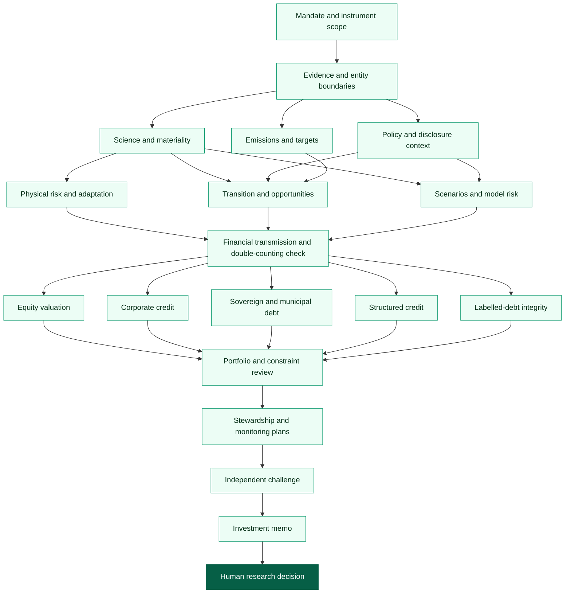
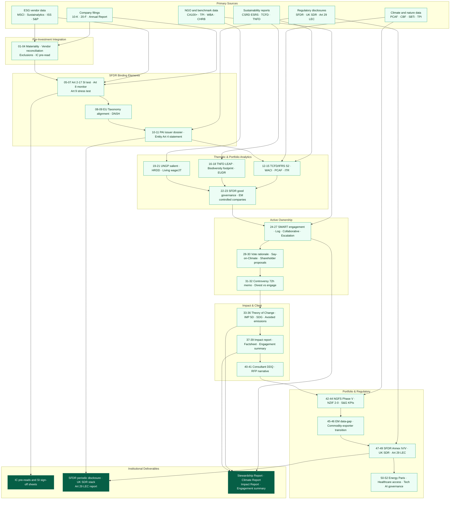

<!-- Profile redesign: original graphics and copy; layout inspired by github.com/flycran. -->

  

  <a href="https://github.com/HHFinAi/climate-investment-ai-agent-in-equity-and-bond-markets"><b>Explore the climate agent</b></a> &nbsp; · &nbsp;
  <a href="#research-workflows"><b>Workflows</b></a> &nbsp; · &nbsp;
  <a href="#selected-research-projects"><b>Research projects</b></a> &nbsp; · &nbsp;
  <a href="https://github.com/hh-health-AI"><b>Sector research</b></a>

<blockquote>
  
<b>From climate and company evidence to explicit investment assumptions.</b> AI should improve research coverage without obscuring sources, uncertainty or accountability.

</blockquote>

## About me

I build **AI-assisted research workflows, analyst skills and public-data tools** for sustainable investing and fundamental equity research. My focus is the connection between evidence, business economics, valuation and human investment judgment.

- **Research:** Climate investing, sustainable finance, growth equities and company earnings.
- **Methods:** Competitive analysis, cash-flow valuation, scenario analysis and evidence-based investment theses.
- **Workflow design:** Reusable agent instructions, structured handoffs, traceable research records and human review.

## Start here: Climate Investment AI Agent

<table>
<tr><td>
<h3><a href="https://github.com/HHFinAi/climate-investment-ai-agent-in-equity-and-bond-markets">Climate Investment AI Agent</a></h3>

<b>Connect climate risk to equity valuation and bond credit analysis.</b>

A Python workflow engine with 20 specialist roles and seven instrument-aware routes, designed to organize climate research while keeping evidence references, assumptions, revisions and human review inspectable.

<b>Core value:</b> Inspect the evidence and assumptions behind the conclusion—not just the generated narrative.

<code>Evidence</code> → <code>Climate scenarios</code> → <code>Financial transmission</code> → <code>Equity / credit</code> → <code>Human review</code>

<a href="https://github.com/HHFinAi/climate-investment-ai-agent-in-equity-and-bond-markets/blob/main/docs/EVIDENCE_AUDIT.md"><b>Inspect the evidence layer →</b></a> &nbsp; · &nbsp; <a href="https://github.com/HHFinAi/climate-investment-ai-agent-in-equity-and-bond-markets#run-the-local-tests-and-synthetic-demo">Run the synthetic demo →</a>

</td></tr>
</table>

**Scope:** The engine orchestrates and validates research artifacts. An external AI host or human performs the research. There is no embedded LLM, live market feed, broker connection or autonomous trading. Reviewable records are not independent audit certification.

<!-- workflow-charts:start -->
## Research workflows

### Climate risk → equity valuation and bond credit

The [Climate Investment AI Agent](https://github.com/HHFinAi/climate-investment-ai-agent-in-equity-and-bond-markets#climate-risk-to-equity-valuation-and-bond-credit-analysis) connects mandate and evidence to climate analysis, instrument-specific underwriting, portfolio review and a human research decision.

[**Explore the source workflow and implementation →**](https://github.com/HHFinAi/climate-investment-ai-agent-in-equity-and-bond-markets#climate-risk-to-equity-valuation-and-bond-credit-analysis)

### Sustainable investment research

The second workflow comes from the **Sustainable Investment Agent for SFDR Article 8 & 9 Funds**. Expand it to follow source inputs through integration, sustainability assessment, stewardship, impact and reporting.

<b>View the full sustainable-investment workflow</b>

[**Explore the source workflow and prompt library →**](https://github.com/HHFinAi/Sustainable-Investment-Agent-for-SFDR-Article-8-9-Funds#workflow-coverage)

Reproduced from the projects' workflow documentation on 24 September 2026, with profile-matched colors. Labels and connections are preserved. These copies do not automatically sync with future repository changes; the diagrams are not a certification of regulatory compliance.
<!-- workflow-charts:end -->

## Selected research projects

<table>
<tr>
<td width="50%" valign="top">
<h3><a href="https://github.com/HHFinAi/Sustainable-Investment-Agent-for-SFDR-Article-8-9-Funds">Sustainable Investment Workflows</a></h3>

<b>Bring structure to sustainable investment research.</b>

A library of 52 prompts across 18 categories for workflows associated with SFDR Article 8 and 9 strategies, including materiality, climate, stewardship, impact and disclosure research.

<code>Sustainable finance</code> <code>Research prompts</code>

</td>
<td width="50%" valign="top">
<h3><a href="https://github.com/HHFinAi/Institutional-Growth-Equity-Skills">Institutional Growth Equity Skills</a></h3>

<b>From business quality to valuation and deliverables.</b>

A bundle of 16 skills spanning competitive positioning, growth research, financial modeling, valuation and research-document production.

<code>Growth equities</code> <code>DCF</code> <code>Scenarios</code>

</td>
</tr>
<tr>
<td width="50%" valign="top">
<h3><a href="https://github.com/HHFinAi/earnings-analysis">Earnings Analysis</a></h3>

<b>Go beyond the headline beat or miss.</b>

Parse filings, releases and transcripts; compare results with expectations; diagnose the drivers; and translate changes into the forward research thesis.

<code>Filings</code> <code>Guidance</code> <code>Earnings quality</code>

</td>
<td width="50%" valign="top">
<h3><a href="https://github.com/HHFinAi/claude-equity-research-skills">Claude Equity Research Skills</a></h3>

<b>Make the fundamental research process reusable.</b>

Seven composable skills covering growth, competition, earnings, supply chains, corporate networks, investment themes and research reports.

<code>Agent skills</code> <code>Fundamental analysis</code>

</td>
</tr>
</table>

## Tools and research craft

  

**Investment research:** `Climate Risk` · `Sustainable Investing` · `Growth Equity` · `Credit Analysis` · `Earnings`

**Research infrastructure:** `Python` · `Agent Skills` · `Structured Evidence` · `Workflow Validation` · `Human Review`

## How I approach the work

**Start with primary sources.** Use company disclosures, filings and documented research inputs—not unsupported narratives.

**Connect the evidence to economics.** Identify the cash-flow, capital-cost, credit or valuation assumption that changes.

**Make uncertainty visible.** Keep scenarios, sensitivities, missing information and disconfirming evidence explicit.

**Keep the analyst accountable.** Automation supports judgment; it does not certify conclusions, guarantee alpha or replace professional review.

## Connect

Working on sustainable finance, public-market research or AI-assisted analysis? Project issues and pull requests are welcome.

  <a href="https://github.com/HHFinAi/climate-investment-ai-agent-in-equity-and-bond-markets/issues"><b>Start a project discussion</b></a> &nbsp; · &nbsp;
  <a href="https://github.com/hh-health-AI"><b>Explore my sector equity research</b></a>

---

Research and educational tools—not investment advice or a certification of regulatory compliance. Prompt libraries require current-source verification; inspect each repository's implementation and limitations.

