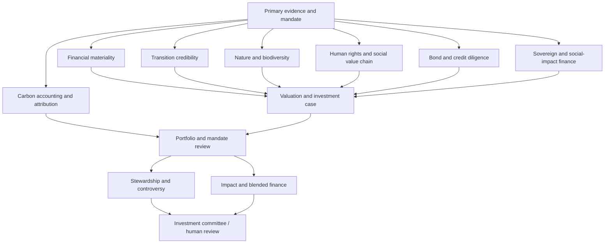

<p align="center">
  
</p>

<h1 align="center">HHFinAi — Institutional Sustainable Finance AI</h1>

<p align="center">
  <b>Open research agents and analyst workflows connecting sustainability evidence to financial materiality, security valuation, portfolio decisions, impact and stewardship.</b>
</p>

<p align="center">
  <b>Institutional-quality buy-side research · Tradable decision support · Traceable evidence · Auditable workflows · Human judgment</b>
</p>

> **Research philosophy:** AI should expand research coverage without obscuring sources, assumptions, uncertainty, legal boundaries or analyst accountability. “Institutional-quality” describes process design and review controls—not independent certification, guaranteed compliance or investment performance.

## Sustainable-finance research stack



## Flagship agents

### Security and issuer underwriting

| Agent | Investment question |
|---|---|
| [**Sustainability-to-Financial-Materiality Analysis**](https://github.com/HHFinAi/Sustainability-to-Financial-Materiality-Analysis) | Which sustainability issues change revenue, margins, cash flow, credit or valuation—and by how much? |
| [**Transition-Plan Credibility Assessment**](https://github.com/HHFinAi/Transition-Plan-Credibility-Assessment) | Are issuer targets supported by comparable boundaries, funded implementation and observable delivery? |
| [**Sustainable Bond Diligence Agent**](https://github.com/HHFinAi/Sustainable-Bond-Diligence-Agent) | Does a labelled or transition bond combine acceptable underlying credit, credible sustainability claims and investable relative value? |
| [**Labelled-Bond and Sustainability-Linked-Bond Diligence**](https://github.com/HHFinAi/Labelled-Bond-and-Sustainability-Linked-Bond-Diligence) | What is the specific bond’s credit, contractual, KPI, label and relative-value case? |
| [**Climate Investment AI Agent**](https://github.com/HHFinAi/climate-investment-ai-agent-in-equity-and-bond-markets) | How do physical and transition risks transmit into equity valuation and bond credit? |

### Portfolio, mandate and ownership

| Agent | Investment question |
|---|---|
| [**Portfolio Carbon Accounting and Attribution**](https://github.com/HHFinAi/Portfolio-Carbon-Accounting-and-Attribution) | What emissions are financed, how complete is the inventory, and why did it change? |
| [**Sustainable-Investment Mandate Assessment**](https://github.com/HHFinAi/Sustainable-Investment-Mandate-Assessment) | Does evidence support the stated mandate under the versioned prospectus and applicable rulebook, and where is the result unknown? |
| [**Stewardship and Controversy Assessment**](https://github.com/HHFinAi/Stewardship-and-Controversy-Assessment) | What is evidenced, what change is sought, and what escalation or investment review is warranted? |
| [**Sustainable Investment Agent for SFDR Article 8 & 9 Funds**](https://github.com/HHFinAi/Sustainable-Investment-Agent-for-SFDR-Article-8-9-Funds) | How can sustainable-investment research, binding elements, stewardship, impact and disclosure be organized into repeatable workflows? |

### Nature, social impact and development finance

| Agent | Investment question |
|---|---|
| [**Nature and Biodiversity Investment Agent**](https://github.com/HHFinAi/Nature-and-Biodiversity-Investment-Agent) | How do ecosystem dependencies, impacts and outcomes connect to financial underwriting without inventing a universal biodiversity score? |
| [**Human-Rights and Social-Value-Chain Diligence**](https://github.com/HHFinAi/Human-Rights-and-Social-Value-Chain-Diligence) | Who may be harmed, how severe is the risk, and what prevention, remedy and investment response is evidenced? |
| [**Impact and Blended-Finance Assessment**](https://github.com/HHFinAi/Impact-and-Blended-Finance-Assessment) | What outcomes and financing are plausibly additional, who bears risk, and is the structure commercially and developmentally defensible? |
| [**Sovereign and Social-Impact Finance Agent**](https://github.com/HHFinAi/Sovereign-and-Social-Impact-Finance-Agent) | How do sovereign repayment, contractual recourse, fiscal economics, additionality and social outcomes fit together? |

## What “institutional-quality” means here

The repositories are designed around inspectable research-process controls:

- **Evidence lineage:** source IDs, dates, document locations and entity/instrument boundaries.
- **Financial transmission:** sustainability issues must connect to explicit cash-flow, credit, valuation or portfolio assumptions when an investment conclusion is made.
- **Reproducible calculations:** deterministic helpers expose inputs, units and assumptions rather than hiding arithmetic in prose.
- **Missing-data discipline:** unknown or unverified evidence remains unknown; material gaps can block approval.
- **Revision control:** upstream changes can invalidate downstream analysis and prior review.
- **Independent challenge:** counterarguments, thesis breakers and unresolved issues remain visible.
- **Human accountability:** agents support research decisions; they do not self-approve investments or execute trades.

## Tradable research, not sustainability commentary

The objective is to move from:

```text
Sustainability disclosure
        ↓
Material issue
        ↓
Financial transmission
        ↓
Security / portfolio implication
        ↓
Valuation, relative value or risk
        ↓
Catalyst / monitoring trigger
        ↓
Human investment decision
```

A sustainability claim is not treated as a trade thesis by itself. Likewise, a credible label, target or impact narrative does not substitute for credit quality, valuation, liquidity or portfolio constraints.

## Repository design

Across the agent suite, repositories generally include:

```text
README.md          → answer-first overview
SKILL.md           → agent/skill entry point
AGENTS.md          → research-stage contracts
WORKFLOW.md        → orchestration and handoffs
sf_agent/          → executable workflow and calculations
schemas/           → structured input/output contracts
skills/            → bounded analytical capabilities
prompts/           → specialist research instructions
references/        → methodology and source controls
examples/          → synthetic worked examples
tests/             → regression and control tests
.github/workflows/ → GitHub CI validation
```

## Core research domains

**Investment analysis:** Sustainable Finance · Climate Investing · Fixed Income · Credit Analysis · Fundamental Equity · Sovereign Debt · Impact Investing

**Sustainability research:** Transition Finance · Carbon Accounting · Nature & Biodiversity · Human Rights · Stewardship · SFDR / Sustainable Mandates · Blended Finance

**Research infrastructure:** Python · Agent Skills · Structured Evidence · Deterministic Calculations · Workflow Validation · Human Review

## Other research infrastructure

My general investment-research work is available in:

- [**Institutional Growth Equity Skills**](https://github.com/HHFinAi/Institutional-Growth-Equity-Skills)
- [**Sector Equity Agent**](https://github.com/HHFinAi/Sector-equity-agent)
- [**Earnings Analysis**](https://github.com/HHFinAi/earnings-analysis)
- [**Claude Equity Research Skills**](https://github.com/HHFinAi/claude-equity-research-skills)

Sector-specific healthcare and life-sciences research is maintained separately at [**hh-health-AI**](https://github.com/hh-health-AI).

## Use and limitations

These repositories are research and educational infrastructure. They are not investment advice, broker systems, autonomous trading agents, independent audit opinions or certifications of regulatory compliance. Most workflows require a human or external AI host to retrieve authorized evidence and perform substantive research. Inspect each repository’s methodology, validation scope and limitations before relying on its output.

---

<p align="center"><b>Evidence → economics → valuation → portfolio decision → human judgment</b></p>
